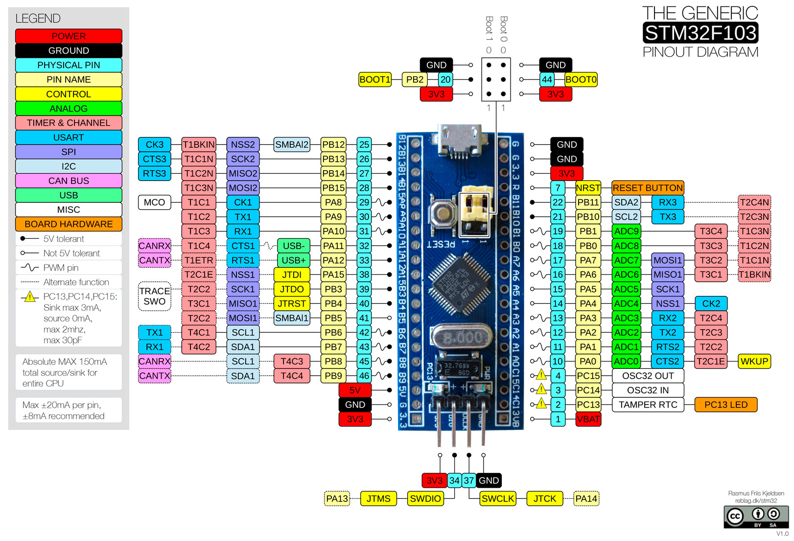

# `stm32f1xx-hal`

> [HAL] for the STM32F1 family of microcontrollers

[HAL]: https://crates.io/crates/embedded-hal

[](https://crates.io/crates/stm32f1xx-hal)
[](https://docs.rs/stm32f1xx-hal)

## Quick start guide

Embedded Rust development requires a bit more setup than ordinary development.
For this guide, we'll assume you're using a stm32 blue pill board (shown
below), but if you have another f1 microcontroller, you should be able to adapt
it.



You will also need a debug probe, for example an [stlink v3
mini](https://www.st.com/en/development-tools/stlink-v3mini.html) for programming and debugging.
(There are many different STLink probes out there, all of them _should_ work fine with this instructions given here, other JTAG or SWD debug probes will work as well but will need different software or configuration).

### Installing software

To program your microcontroller, you need to install:
- [openocd](http://openocd.org/)
- `arm-none-eabi-gdb`

Finally, you need to install arm target support for the Rust compiler. To do
so, run
```
rustup target install thumbv7m-none-eabi
```


### Setting up your project

Create a new Rust project as you usually do with `cargo init`. The hello world
of embedded development is usually to blink an LED and code to do so is
available in [examples/blinky.rs](examples/blinky.rs). Copy that file to the
`main.rs` of your project.

You also need to add some dependencies to your `Cargo.toml`:

```toml
[dependencies]
embedded-hal = "0.2.3"
nb = "0.1.2"
cortex-m = "0.6.2"
cortex-m-rt = "0.6.11"
# Panic behaviour, see https://crates.io/keywords/panic-impl for alternatives
panic-halt = "0.2.0"

[dependencies.stm32f1xx-hal]
version = "0.5.3"
features = ["rt", "stm32f103", "medium"]
```

If you build your project now, you should get a single error: `error: language
item required, but not found: eh_personality`. This unhelpful error message 
is fixed by compiling for the right target.

We also need to tell Rust how to link our executable, and how to lay out the
result in memory. To accomplish all this, copy [.cargo/config](.cargo/config) and
[memory.x](memory.x) from the stm32f1xx-hal repo to your project.

```bash
cargo build
```

If everything went well, your project should have built without errors.


### Programming the microcontroller

It is now time to actually run the code on the hardware.  To do so plug your
debug probe into the blue pill and start `openocd` using
```bash
openocd -f interface/stlink-v3.cfg -f target/stm32f1x.cfg
```
If you are not using an stlink V3, change the interface accordingly. 
For more information, see the [embeddonomicon].

If all went well, it should detect your microcontroller and say `Info :
stm32f1x.cpu: hardware has 6 breakpoints, 4 watchpoints`. Keep it running in
the background.

We will use gdb for uploading the compiled binary to the microcontroller and
for debugging. Cargo will automatically start `gdb` thanks to the
[.cargo/config](.cargo/config) you added earlier. `gdb` also needs to be told
to connect to openocd which is done by copying [.gdbinit](.gdbinit) to the root
of your project.

You may also need to tell `gdb` that it is safe to load `.gdbinit` from the
working directory.
- Linux
  ```bash
  echo "set auto-load safe-path $(pwd)" >> ~/.gdbinit
  ```
- Windows
  ```batch
  echo set auto-load safe-path %CD% >> %USERPROFILE%\.gdbinit
  ```

If everything was successful, cargo should compile your project, start gdb,
load your program and give you a prompt. If you type `continue` in the gdb
prompt, your program should start and the green led on the blue pill should
start blinking.


### Going further

From here on, you can start adding more code to your project to make it do
something more interesting. For crate documentation, see
[docs.rs/stm32f1xx-hal](https://docs.rs/stm32f1xx-hal). There are also a lot
more [examples](examples) available. If something is unclear in the docs or
examples, please, open an issue and we will try to improve it.


## Selecting a microcontroller

This crate supports multiple microcontrollers in the
stm32f1 family. Which specific microcontroller you want to build for has to be
specified with a feature, for example `stm32f103`. 

If no microcontroller is specified, the crate will not compile.

You may also need to specify the density of the device with `medium`, `high` or `xl` 
to enable certain peripherals. Generally the density can be determined by the 2nd character 
after the number in the device name (i.e. For STM32F103C6U, the 6 indicates a low-density
device) but check the datasheet or CubeMX to be sure.
* 4, 6 => low density, no feature required
* 8, B => `medium` feature
* C, D, E => `high` feature
* F, G => `xl` feature

### Supported Microcontrollers

* `stm32f100`
* `stm32f101`
* `stm32f103`


## Trying out the examples

You may need to give `cargo` permission to call `gdb` from the working directory.
- Linux
  ```bash
  echo "set auto-load safe-path $(pwd)" >> ~/.gdbinit
  ```
- Windows
  ```batch
  echo set auto-load safe-path %CD% >> %USERPROFILE%\.gdbinit
  ```

Compile, load, and launch the hardware debugger.
```bash
$ rustup target add thumbv7m-none-eabi

# on another terminal
$ openocd -f interface/$INTERFACE.cfg -f target/stm32f1x.cfg

# flash and debug the "Hello, world" example. Change stm32f103 to match your hardware
$ cargo run --features stm32f103 --example hello
```

`$INTERFACE` should be set based on your debugging hardware. If you are using
an stlink V2, use `stlink-v2.cfg`. For more information, see the
[embeddonomicon].

[embeddonomicon]: https://rust-embedded.github.io/book/start/hardware.html


## Using as a Dependency

When using this crate as a dependency in your project, the microcontroller can 
be specified as part of the `Cargo.toml` definition.

```toml
[dependencies.stm32f1xx-hal]
version = "0.5.3"
features = ["stm32f100", "rt"]
```

## Documentation

The documentation can be found at [docs.rs](https://docs.rs/stm32f1xx-hal/).

## License

Licensed under either of

- Apache License, Version 2.0 ([LICENSE-APACHE](LICENSE-APACHE) or
  http://www.apache.org/licenses/LICENSE-2.0)
- MIT license ([LICENSE-MIT](LICENSE-MIT) or http://opensource.org/licenses/MIT)

at your option.

### Contribution

Unless you explicitly state otherwise, any contribution intentionally submitted
for inclusion in the work by you, as defined in the Apache-2.0 license, shall be
dual licensed as above, without any additional terms or conditions.
